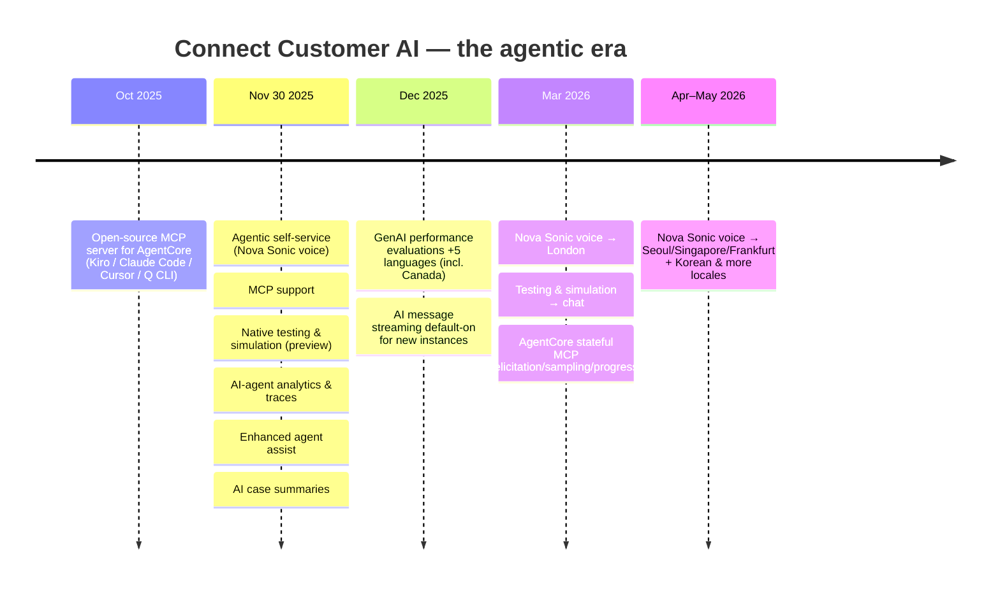
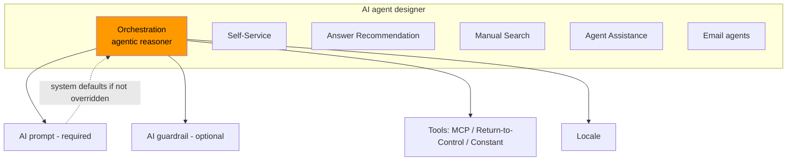

# The Amazon Connect Customer AI Agent Landscape in 2026 — What Changed, What's Native, and When to Build Custom

> **Research deliverable 1 of 3.** A long-form orientation to Connect Customer's native AI agents as they actually exist in mid-2026, plus a decision framework for native-vs-custom.
> **As of:** 2026-06-09. **Recency filter:** post–Nov 30 2025. Pre-Nov-2025 "legacy self-service" is documented as deprecated-for-new-builds.
> **Reviewed as:** Connect specialist SA + GenAI specialist SA. Companion to doc 02 (hands-on build) and doc 03 (Canada compliance).

---

## Why this document exists

If you last looked at "AI in Amazon Connect" before late 2025, almost everything you knew has a new name and a new center of gravity. The product is now **Amazon Connect Customer**. "Amazon Q in Connect" is no longer the headline — it's one configurable agent type among many. And the thing you'd build today, **agentic self-service**, didn't exist a few months ago. This doc is the map: what the pieces are now called, what shipped, what's native, and where the line to "build it yourself" actually falls.

It is deliberately opinionated and verbose, because the failure mode for an experienced builder here isn't "can't find the feature" — it's *building on last year's pattern*. We'll call those out explicitly.

## 1. The naming reset (read this first)

The rebrand is not cosmetic; it reaches into the console, the docs, and — partially — the API.

| You may know it as | It is now |
|---|---|
| Amazon Connect (the product) | **Amazon Connect Customer** |
| "Amazon Q in Connect" (the AI brand) | **One configurable AI agent type** among several — not the headline |
| Generative-AI self-service (built-in tools) | **Legacy self-service** — *"not receiving new feature updates"* |
| — | **Agentic self-service** — the recommended path for all new builds |

There's a trap here that will bite your infrastructure-as-code: **the brand moved, but the API did not.** The control plane, CLI, and SDKs still use the **`qconnect`** namespace ("Q in Connect"). The Lex built-in intent is `AMAZON.QinConnectIntent`. The orchestrator config object is `OrchestrationAIAgentConfiguration` in the `qconnect` API. So your Terraform/boto3/CLI will say `qconnect` everywhere even as the console says "Connect Customer AI agents." Expect it; don't fight it.

## 2. What actually shipped (newest-first)

The throughline: Connect's AI went from **"answer questions from a knowledge base"** to **"reason across multiple steps and take actions via tools."** For your concierge project, the consequence is concrete — **action-taking is now a native capability, not a custom build you defer to phase 2.**

## 3. The mental model: typed agents, not a chatbot

The single most useful thing to internalize: in Connect Customer, an **"AI agent" is a typed, configurable resource**, and your whole system is composed from these types plus tools and routing — not from a fleet of conversational bots talking to each other.

The system ships **default AI agents per use case** (Orchestration, Answer Recommendation, Manual Search, Self Service, Email Response/Overview/Generative Answer, Note Taking, Agent Assistance, Case Summarization). You **override** the ones you want to customize; the rest fall back to system defaults at runtime. An agent is the tuple **(AI prompt(s) + one AI guardrail + tools + locale)**.

### The three tiers of self-service — don't confuse them
A recurring mistake (I made it in my own first draft) is conflating "native legacy" with "a custom sample." There are **three distinct things**:

| Tier | What it is | When to use |
|---|---|---|
| **Agentic self-service** | Orchestrator agent: multi-step reasoning, MCP tools, continuous conversation. Tools = MCP / Return-to-Control (`Complete`, `Escalate`, custom) / Constant. Voice responses wrapped in `<message>` tags. | ✅ **All new builds** |
| **Native legacy self-service** | Built-in tools `QUESTION`, `ESCALATION`, `CONVERSATION`, `COMPLETE`, `FOLLOW_UP_QUESTION` via `AMAZON.QinConnectIntent`; returns control to the flow per tool (`ESCALATION` takes the *Error* branch of *Get customer input*). | ⚠️ Concepts only — no new features |
| **Custom solution** (e.g. `aws-samples/contact-center-genai-agent`) | A fully hand-built Lex + Bedrock Knowledge Base RAG app you own end-to-end. | Reference for the *retrieval layer*, not a target architecture |

## 4. The native toolbox, briefly (deep dives in doc 02)

- **Action-taking via MCP** — out-of-the-box tools (update contact attributes, retrieve case info, start tasks), **flow modules as tools** (reuse Connect logic), and **custom/third-party tools via AgentCore Gateway**. Hard limits: **30-second** tool timeout; **one gateway ↔ one instance ↔ one MCP server**.
- **Voice** — **Amazon Nova Sonic** speech-to-speech, configured per Lex bot locale + a *Generative* Set voice block. (Regional caveat is the whole of doc 03.)
- **AI Guardrails** — Amazon Bedrock guardrails, **max 3**: content filters, denied topics (≤30), **contextual grounding** (anti-hallucination), word filters, **sensitive-information/PII filters** (block or mask; SSN/DOB/card + custom regex). No image filter. Adds **time-to-first-token** latency on streaming voice.
- **Model lifecycle** — each prompt pins a model; agents reference immutable prompt versions; default configs are pinned-or-`Latest`. Connect auto-redirects on deprecation, but pin versions for change control. **Available models depend on the instance Region** (doc 03 has the table — and it's a real constraint in Canada).
- **Testing & simulation** — native, pre-deploy validation (observe/check/actions); available in ca-central-1; limits of 5 concurrent / 100 queue / 5-min.
- **Analytics & traces** — per-interaction tool-invocation visibility for audit.

## 5. Cost lens (the SA habit)
AI agents, Nova Sonic, MCP usage, and guardrails are **usage-priced add-ons on top of Connect's base per-minute/per-message rates** — see the [pricing page](https://aws.amazon.com/connect/pricing/) for figures (not quoting unverified numbers). The SA framing: human handle time dominates contact-center cost, so deflection usually pays for premium AI rates — **but** guardrail scans and multi-tool turns add both latency and per-interaction cost. Model the *turns per resolution*, not just per-minute price.

## 6. Native vs custom — the decision framework

The boundary moved. Native agentic self-service **is** the agent framework; "custom" now mostly means **the MCP tool servers and backend you own** (often on AgentCore Runtime), not a hand-rolled LLM loop inside Connect.

| Axis | Lean **native** | Lean **custom** (AgentCore/Bedrock behind MCP) |
|---|---|---|
| Conversation orchestration on voice/chat | ✅ orchestrator + Nova Sonic | rarely worth rebuilding |
| Grounded Q&A (phase 1) | ✅ KB retrieve tool | only for bespoke retrieval |
| Actions in your systems | OOTB + flow-module tools | ✅ custom MCP servers wrapping Lambdas/APIs |
| Complex multi-agent / non-Connect channels | orchestrator + tools only | ✅ external agents as MCP/A2A tools |
| **Strict Canadian residency / model choice** | ⚠️ cross-region inference + region-limited models (doc 03) | ✅ pin Bedrock model + Region (subject to availability) |
| Speed to first working voice agent | ✅ fastest | slower |

**Rule of thumb:** build **conversation + escalation natively**; build **actions as MCP tools you own**; reserve fully-custom agent loops for what the orchestrator can't express, or for residency/model control that native managed-AI can't guarantee. That last clause is not hypothetical for a Canadian bank — it's the subject of doc 03.

## Sources
- [Connect Customer AI agent self-service](https://docs.aws.amazon.com/connect/latest/adminguide/ai-agent-self-service.html) · [Agentic self-service](https://docs.aws.amazon.com/connect/latest/adminguide/agentic-self-service.html) · [(legacy) generative-AI self-service](https://docs.aws.amazon.com/connect/latest/adminguide/generative-ai-powered-self-service.html)
- [Create AI agents](https://docs.aws.amazon.com/connect/latest/adminguide/create-ai-agents.html) · [Create AI prompts](https://docs.aws.amazon.com/connect/latest/adminguide/create-ai-prompts.html) · [Create AI guardrails](https://docs.aws.amazon.com/connect/latest/adminguide/create-ai-guardrails.html) · [Upgrade models for AI prompts & agents](https://docs.aws.amazon.com/connect/latest/adminguide/upgrade-models-ai-prompts-agents.html)
- [AI agent MCP tools](https://docs.aws.amazon.com/connect/latest/adminguide/ai-agent-mcp-tools.html) · [Nova Sonic S2S](https://docs.aws.amazon.com/connect/latest/adminguide/nova-sonic-speech-to-speech.html) · [Testing & simulation](https://docs.aws.amazon.com/connect/latest/adminguide/testing-simulation.html) · [AI in Connect Customer](https://docs.aws.amazon.com/connect/latest/adminguide/ai-in-connect.html)
- What's New (Nov 30 2025): [agentic self-service](https://aws.amazon.com/about-aws/whats-new/2025/11/amazon-connect-agentic-self-service/) · [MCP support](https://aws.amazon.com/about-aws/whats-new/2025/11/amazon-connect-mcp-support/) · [testing & simulation](https://aws.amazon.com/about-aws/whats-new/2025/11/amazon-connect-native-testing-simulation-capabilities-preview/)
- [Prescriptive Guidance: Agentic AI patterns](https://docs.aws.amazon.com/prescriptive-guidance/latest/agentic-ai-patterns/introduction.html) · [Connect pricing](https://aws.amazon.com/connect/pricing/)
