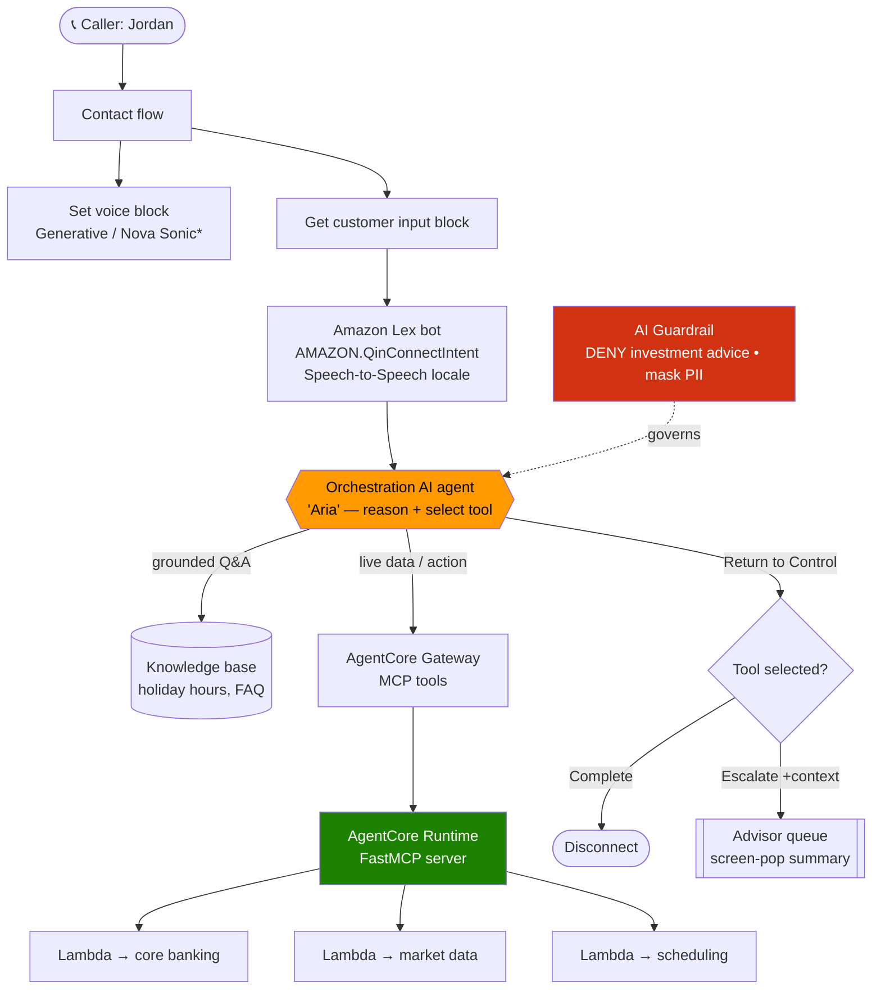
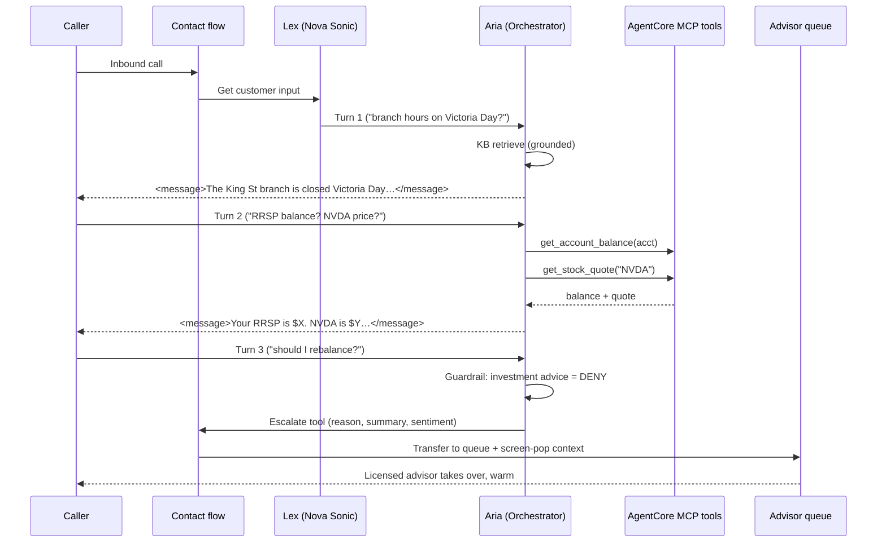
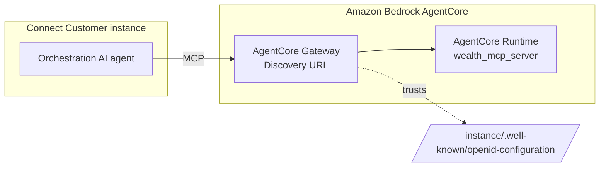

# Building a Wealth-Management Voice Concierge on Amazon Connect Customer — An End-to-End Walkthrough

> **Research deliverable 2 of 3 — the hands-on guide.** This is the centerpiece: a long-form, AWS-blog-style walkthrough that takes you from an empty Connect Customer instance to a working **agentic voice concierge** for a Canadian bank's wealth-management line, then escalates to a licensed advisor with full context.
> **As of:** 2026-06-09. Post–Nov 30 2025 agentic path. **Code fidelity:** verified-faithful — API/CLI/JSON shapes are taken from the AWS docs (sources at the end). Anything I could not fully verify is explicitly marked *illustrative*.
> **Scenario:** "**Aria**," the wealth-management concierge. Voice-first. Channels into your existing Lambda/core-banking and market-data services through MCP tools.

---

## 1. What we're building (and the one rule that governs it)

Picture a private-banking client, *Jordan*, calling the wealth-management line of a Canadian bank. Jordan wants three very different things in one call:

1. **"What time does the King Street branch open on Victoria Day?"** — a *grounded knowledge* question (holiday hours live in documents).
2. **"What's my RRSP balance, and what did I spend last week? Oh, and what's NVDA trading at?"** — *live data* questions (account + market data behind APIs).
3. **"Can someone help me rebalance my portfolio?"** — a request that **must reach a licensed human advisor**, because an AI agent giving investment advice is a compliance violation.

That third point is the rule that governs the entire design: **the concierge answers and acts on operational/account questions, but it must never give investment advice — it escalates those to a licensed advisor.** We enforce that rule *technically*, with a guardrail (§7), not just with a prompt.

### The capability map

| Jordan asks… | Concierge does… | Mechanism |
|---|---|---|
| Holiday branch hours | Grounded answer from a knowledge base | KB retrieve (RAG) |
| Account balance / recent transactions | Live lookup in core banking | **MCP tool** → Lambda |
| Stock quote | Live market data | **MCP tool** → market-data API |
| Book time with an advisor | Creates an appointment | **MCP tool** → scheduling |
| "Should I buy X?" / complex needs | **Escalate** to a licensed advisor with context | **Return-to-Control** tool + contact flow |
| "Talk to a human" | Escalate | Default `Escalate` tool |

## 2. The architecture at a glance

The "concierge + specialists" model maps to **one Orchestration AI agent** that reasons over the conversation and selects **tools** — it is *not* a swarm of chatting bots. Specialization lives in the tool set and in contact-flow routing.



> \* **Nova Sonic is us-east-1/us-west-2 only — not ca-central-1.** In Canada you run the same design with standard voice. See doc 03; we build in a us-east-1 sandbox here to exercise the full voice experience.

### A single call, end to end



The rest of this doc builds each block, bottom-up: **tools first** (because the agent is only as useful as what it can do), then the **agent**, then the **voice/flow wiring**, then **governance and testing**.

---

## 3. Prerequisites

- A Connect Customer instance **with AI agent designer enabled**. Note its **Assistant ID** (the `qconnect` assistant) — you'll pass it to every `qconnect` call. The admin site is `https://{instance}.my.connect.aws/`.
- For the Nova Sonic voice experience: build in **us-east-1** (or us-west-2). For the Canada-resident variant, use ca-central-1 with standard voice (doc 03).
- AWS CLI v2, Python ≥ 3.10, and permissions for `qconnect`, `bedrock-agentcore`, `lambda`, and `lex`.

> 🔧 **Brand vs API:** the console says "Connect Customer AI agents," but the API/CLI/SDK namespace is **`qconnect`** ("Q in Connect"). Every command below uses `aws qconnect …` / `boto3.client("qconnect")`. Don't let the rebrand surprise your IaC.

---

## 4. Step 1 — Build the MCP tool server (the concierge's hands)

The concierge's *actions* are MCP tools. The cleanest place to host custom tools is **Amazon Bedrock AgentCore Runtime**, which runs an MCP server container for you (no Docker/Kubernetes). You write a standard **FastMCP** server; each `@mcp.tool()` becomes a tool the orchestrator can call.

`wealth_mcp_server.py`:

```python
# wealth_mcp_server.py
# Verified shape: FastMCP + streamable-http, per AWS AgentCore Runtime MCP guide.
from mcp.server.fastmcp import FastMCP

# AgentCore Runtime expects the server on 0.0.0.0:8000/mcp.
# stateless_http=True is the recommended default for simple tool servers.
mcp = FastMCP(host="0.0.0.0", stateless_http=True)


@mcp.tool()
def get_account_balance(account_id: str) -> dict:
    """Return the current balance for a wealth-management account.
    account_id: the client's internal account identifier."""
    # In production this calls your core-banking API (via Lambda/VPC).
    return {"account_id": account_id, "currency": "CAD", "balance": 152_340.18}


@mcp.tool()
def list_recent_transactions(account_id: str, limit: int = 5) -> list[dict]:
    """List the most recent transactions for an account (read-only)."""
    return [
        {"date": "2026-06-02", "description": "Dividend - XIU", "amount": 412.55},
        {"date": "2026-06-01", "description": "Advisory fee", "amount": -85.00},
    ][:limit]


@mcp.tool()
def get_stock_quote(symbol: str) -> dict:
    """Return a delayed market quote for a ticker symbol (informational only)."""
    # Calls your market-data provider. NOTE: quoting a price is informational;
    # recommending a security is investment advice and is blocked by guardrail.
    return {"symbol": symbol.upper(), "price": 118.42, "currency": "USD",
            "as_of": "2026-06-09T14:30:00Z", "delayed_minutes": 15}


@mcp.tool()
def book_advisor_appointment(client_id: str, topic: str, preferred_day: str) -> dict:
    """Book a meeting with a licensed advisor. A safe, reversible action.
    Does NOT execute any trade or move any funds."""
    return {"confirmation_id": "APPT-7741", "client_id": client_id,
            "topic": topic, "scheduled_for": f"{preferred_day} 10:00 ET", "status": "BOOKED"}


if __name__ == "__main__":
    mcp.run(transport="streamable-http")
```

> ⚠️ **Design rule baked into the tools:** every tool is **read-only or a safe, reversible booking**. There is deliberately no `place_trade` / `transfer_funds` tool — executing financial transactions is out of scope for the self-service agent and belongs to a licensed human (and to your safety policy). The agent can *inform* (quote a price) but cannot *advise* or *transact*.

### Test it locally, then deploy

```bash
pip install mcp
python wealth_mcp_server.py          # serves on http://localhost:8000/mcp
```

Deploy to AgentCore Runtime (verified flow):

```bash
npm install -g @aws/agentcore          # AgentCore CLI
agentcore create --protocol MCP        # scaffolds agentcore/agentcore.json
# copy wealth_mcp_server.py into the generated project; set it as the entrypoint
agentcore deploy
# → returns an ARN like:
# arn:aws:bedrock-agentcore:us-east-1:<acct>:runtime/wealth_mcp_server-xyz123
```

AgentCore packages the code, uploads to S3, creates the runtime, and returns the **runtime ARN**. (OAuth via a Cognito user pool is set up as part of `agentcore create`; AgentCore uses a service-linked role for workload identity.)

---

## 5. Step 2 — Expose the tools to Connect via an AgentCore Gateway

Connect Customer consumes third-party MCP tools through a **Bedrock AgentCore Gateway**, registered as an integration. The gateway turns your APIs/Lambdas/MCP server into AI-agent-callable tools.



In the admin site: **AI agent designer → integrations → Add integration → Integration type = MCP server**, then select (or create in AgentCore) the gateway.

> **Verified constraints worth tattooing on the wall:**
> - The gateway's **Discovery URL** must be `https://{instance}.my.connect.aws/.well-known/openid-configuration`.
> - **One gateway ↔ one Connect instance ↔ one MCP server.** Plan one gateway per tool server.
> - Each **MCP tool invocation times out at 30 seconds.** Your Lambdas must answer fast or run async-then-poll.

You can also skip custom servers for simple needs: Connect ships **out-of-the-box MCP tools** (update contact attributes, retrieve case info, start tasks) and lets you turn **flow modules into MCP tools** to reuse existing contact-flow logic.

---

## 6. Step 3 — Ground the agent with a knowledge base (holiday hours & FAQ)

The "what time does the branch open on Victoria Day" question is answered by **retrieval**, not a tool call. Connect AI agents retrieve from a knowledge base; the orchestrator's prompt is wired to call retrieval when a question is informational. The KB-retrieve capability is gated by the `Connect assistant - View Access` permission (see §10).

Author your holiday-hours and branch-operations content as KB articles. Keep them **atomic and dated** (e.g., one article per statutory holiday) so contextual-grounding (§7) can verify answers against a clear source.

---

## 7. Step 4 — The guardrail that enforces the compliance rule

This is the most important block for a bank. Connect **AI Guardrails are Amazon Bedrock guardrails**; you can have **up to three** per instance. We use two policies that map directly to wealth-management compliance:

1. **Denied topic = investment advice.** The agent may discuss balances and quote prices, but must refuse to recommend securities or strategies.
2. **Sensitive-information filter.** Mask/of block PII so card/account identifiers never land in transcripts or model output.

Create the guardrail, then configure policies (verified `qconnect` CLI — AWS's own example literally uses a "Financial Advice" DENY topic):

```bash
# 1) Deny investment-advice topics (verified shape; adapted to wealth mgmt)
aws qconnect update-ai-guardrail --cli-input-json '{
  "assistantId": "<YOUR_ASSISTANT_ID>",
  "aiGuardrailId": "<YOUR_GUARDRAIL_ID>",
  "blockedInputMessaging": "I can help with account and branch questions, but I cannot give investment advice. Let me connect you with a licensed advisor.",
  "blockedOutputsMessaging": "I cannot provide investment advice. I will connect you with a licensed advisor.",
  "visibilityStatus": "PUBLISHED",
  "topicPolicyConfig": {
    "topicsConfig": [
      {
        "name": "Investment Advice",
        "definition": "Recommendations or guidance to buy, sell, or hold specific securities, or to adopt a particular investment or portfolio strategy.",
        "examples": [
          "Which stocks should I buy?",
          "Should I move my RRSP into bonds?",
          "Is now a good time to sell my tech holdings?"
        ],
        "type": "DENY"
      }
    ]
  }
}'
```

```bash
# 2) Detect hallucinations against the knowledge source (verified shape)
aws qconnect update-ai-guardrail --cli-input-json '{
  "assistantId": "<YOUR_ASSISTANT_ID>",
  "aiGuardrailId": "<YOUR_GUARDRAIL_ID>",
  "blockedInputMessaging": "Blocked input text by guardrail",
  "blockedOutputsMessaging": "I want to be accurate here — let me get a colleague to confirm.",
  "visibilityStatus": "PUBLISHED",
  "contextualGroundPolicyConfig": {
    "filtersConfig": [ { "type": "RELEVANCE", "threshold": 0.50 } ]
  }
}'
```

```bash
# 3) Block sensitive data (verified piiEntitiesConfig shape)
aws qconnect update-ai-guardrail --cli-input-json '{
  "assistantId": "<YOUR_ASSISTANT_ID>",
  "aiGuardrailId": "<YOUR_GUARDRAIL_ID>",
  "blockedInputMessaging": "Blocked input text by guardrail",
  "blockedOutputsMessaging": "Blocked output text by guardrail",
  "visibilityStatus": "PUBLISHED",
  "sensitiveInformationPolicyConfig": {
    "piiEntitiesConfig": [
      { "type": "CREDIT_DEBIT_CARD_NUMBER", "action": "BLOCK" }
    ]
  }
}'
```

> 🇨🇦 **Canada built-in PII type (verified):** there's a built-in **`CA_SOCIAL_INSURANCE_NUMBER`** entity type (and `CA_HEALTH_NUMBER`) — no custom regex needed. Add `{ "type": "CA_SOCIAL_INSURANCE_NUMBER", "action": "ANONYMIZE" }` to `piiEntitiesConfig`. For anything truly custom, `sensitiveInformationPolicyConfig.regexesConfig` takes `{name, description, pattern, action}`. (The runnable scaffold in `agents/concierge/setup_agent.py` uses both via boto3.)

> ⚠️ **Voice latency caveat:** guardrails buffer and scan text before delivery, which **adds time-to-first-token** on streaming responses. On a live voice call that's perceptible — apply guardrails deliberately, and test (see §11).

---

## 8. Step 5 — The orchestration prompt and the AI agent

### 8a. The orchestration AI prompt
An **AI prompt** is the LLM's task definition, authored in YAML. For the orchestrator, start from the **Orchestration** prompt type and the `SelfServiceOrchestration` system prompt, then specialize it. Prompts use the `MESSAGES` format; tools are declared with `name` / `description` / `input_schema` (JSON Schema). Critically, the template ends with an **assistant message prefill** that reinforces the required `<message>` wrapping:

```yaml
# Orchestration prompt (MESSAGES format) — specialized for "Aria"
system: |
  You are Aria, a wealth-management concierge for a Canadian bank.
  You can: answer branch/operations questions from the knowledge base,
  look up account balances and recent transactions, quote market prices,
  and book appointments with a licensed advisor.
  You must NOT give investment advice or recommend securities — if asked,
  use the Escalate tool to hand off to a licensed advisor.
  Always wrap responses to the customer in <message></message> tags.
messages:
  - role: user
    content: "{{$.transcript}}"
  # Assistant message prefill — reinforces <message> formatting.
  - role: assistant
    content: <message>
```

> ⚠️ **Verified model-specific gotcha:** if you select certain models — `us|eu|jp|au|global.anthropic.claude-sonnet-4-6`, or `openai.gpt-oss-20b/120b` — you **must delete** the trailing `- role: assistant / content: <message>` prefill, or the prompt errors. For all other models, leave it. (This is a real footgun called out in the AWS docs.)

The model itself defaults to the **region's system default**; the dropdown only shows models available in your instance's Region. In **ca-central-1** that menu is small (see doc 03) — design for it.

### 8b. Create the Orchestration AI agent (verified CLI)
The agent ties the prompt + guardrail + tools + locale together. The verified configuration object for `ORCHESTRATION` is `orchestrationAIAgentConfiguration` with `orchestrationAIPromptId` (**required**), `orchestrationAIGuardrailId`, `connectInstanceArn`, `locale`, and `toolConfigurations[]`:

```bash
aws qconnect create-ai-agent \
  --assistant-id <YOUR_ASSISTANT_ID> \
  --name aria_wealth_concierge \
  --visibility-status PUBLISHED \
  --type ORCHESTRATION \
  --configuration '{
    "orchestrationAIAgentConfiguration": {
      "orchestrationAIPromptId": "<PROMPT_ID:VERSION>",
      "orchestrationAIGuardrailId": "<GUARDRAIL_ID:VERSION>",
      "connectInstanceArn": "arn:aws:connect:us-east-1:<acct>:instance/<instance-id>",
      "locale": "en_US"
    }
  }'
```

The same call in **boto3** (Python), the path you'll likely automate from this repo:

```python
import boto3

qc = boto3.client("qconnect", region_name="us-east-1")

resp = qc.create_ai_agent(
    assistantId="<YOUR_ASSISTANT_ID>",
    name="aria_wealth_concierge",
    type="ORCHESTRATION",
    visibilityStatus="PUBLISHED",
    configuration={
        "orchestrationAIAgentConfiguration": {
            "orchestrationAIPromptId": "<PROMPT_ID:VERSION>",
            "orchestrationAIGuardrailId": "<GUARDRAIL_ID:VERSION>",
            "connectInstanceArn": "arn:aws:connect:us-east-1:<acct>:instance/<instance-id>",
            "locale": "en_US",
            # toolConfigurations: array of ToolConfiguration objects.
            # MCP tools are typically attached in the AI agent designer from the
            # gateway's namespace; the exact inner JSON is the ToolConfiguration
            # API type — confirm field names in the API reference before scripting.
        }
    },
)
print(resp["aiAgent"]["aiAgentId"])
```

> 🔎 **Fidelity note:** `orchestrationAIPromptId`, `orchestrationAIGuardrailId`, `connectInstanceArn`, `locale`, and `toolConfigurations` are **verified** field names (Amazon Q Connect API reference). The *contents* of each `ToolConfiguration` (how a specific MCP tool / Return-to-Control tool is encoded) I did **not** fully verify here — attach tools via the **AI agent designer** (point-and-click from the gateway namespace) and treat any hand-written `toolConfigurations` JSON as illustrative until checked against `API_amazon-q-connect_ToolConfiguration`.

Finally, set Aria as the default **Self Service** agent: **AI Agents → Default AI Agent Configurations → Self Service** row.

---

## 9. Step 6 — Voice + flow wiring

### 9a. The Lex bot and the Connect AI agent intent
Agentic self-service runs behind an **Amazon Lex** bot via the built-in **`AMAZON.QinConnectIntent`**:
1. Create the bot **inside the Connect Customer admin site** (the toggle is only available for bots created there).
2. Bot → **Configuration** tab → enable **AMAZON.QinConnectIntent**, choose the Connect AI agent intent ARN, **Confirm**.

> ⚠️ **Verified incompatibility:** you **cannot** combine `AMAZON.QinConnectIntent` with `AMAZON.QnAIntent` or `AMAZON.BedrockAgentIntent` in the same bot locale. Pick one generative intent per locale.

For voice, set the locale's **Speech model → Speech-to-Speech → Amazon Nova Sonic**, then **Build language**. (us-east-1/us-west-2 only — doc 03.)

### 9b. The contact flow
Build the flow with these blocks (the routing on Return-to-Control tools is the heart of it):

1. **Set logging behavior** → on.
2. **Set voice** → *Override speaking style = Generative*, choose a Nova Sonic voice (e.g., `Matthew (en-US)`).
3. **Get customer input** → invoke the Lex bot (Aria runs behind the intent).
4. **Check contact attributes** → read the tool Aria selected:
   - **Namespace:** `Lex`
   - **Key:** `Session attributes`
   - **Session Attribute Key:** `Tool`
5. Branch on the value:
   - `Complete` → **Disconnect**
   - `Escalate` → **Set contact attributes** (copy context, §10) → **Set working queue** → **Transfer to queue** (advisor queue)
   - **No Match** → **Disconnect** / fallback

> For **chat**, enable **AI message streaming** (`MESSAGE_STREAMING` instance attribute; default-on for instances created after Dec 2025) and ensure the Lex bot has `lex:RecognizeMessageAsync`. Streaming also **eliminates Lex timeout limits** for long agent turns — relevant when a tool chain runs near the 30-s ceiling.

---

## 10. Step 7 — Escalation with context (the warm handoff)

A cold transfer wastes the conversation. Replace the default `Escalate` with a **custom Return-to-Control tool** whose input schema captures structured context. When Aria invokes it, the AI conversation ends, control returns to the flow, and the tool's inputs land in **Lex session attributes**. This input schema is verified from the AWS example:

```json
{
  "type": "object",
  "properties": {
    "customerIntent": { "type": "string",
      "description": "A brief phrase describing what the customer wants to accomplish" },
    "sentiment": { "type": "string", "enum": ["positive", "neutral", "frustrated"],
      "description": "Customer's emotional state during the conversation" },
    "escalationSummary": { "type": "string", "maxLength": 500,
      "description": "What the customer asked, what was attempted, and why escalation is needed" },
    "escalationReason": { "type": "string",
      "enum": ["investment_advice","complex_request","technical_issue",
               "customer_frustration","policy_exception","out_of_scope","other"] }
  },
  "required": ["escalationReason","escalationSummary","customerIntent","sentiment"]
}
```

In the flow, after the `Escalate` branch, use **Set contact attributes** to copy each Lex session attribute into a contact attribute, then a **Set event flow → Default flow for agent UI** to screen-pop the summary/reason/sentiment to the advisor:

| Destination key | Source namespace | Source session attribute key |
|---|---|---|
| escalationReason | Lex – Session attributes | escalationReason |
| escalationSummary | Lex – Session attributes | escalationSummary |
| customerIntent | Lex – Session attributes | customerIntent |
| sentiment | Lex – Session attributes | sentiment |

Now `escalationReason = investment_advice` both **routes** Jordan to the licensed-advisor queue *and* tells the advisor exactly why — the handoff is warm.

### Governance (security profiles)
Tool access is governed by **security profiles**, the same framework as human agents:

| Aria's tool | Required permission |
|---|---|
| Knowledge base (retrieve) | `Connect assistant - View Access` |
| Cases (create/update/search) | `Cases - View/Edit in Agent Applications` |
| Tasks (StartTaskContact) | `Tasks - Create in Agent Applications` |
| AgentCore gateway tools | Granted on the integration's security profile |

> ⚠️ **Agent-assist shared-permission rule:** when a *human* agent uses Aria's assist features, the human's profile must include the **same** permissions as Aria's tools, or tool calls fail (the AI runs inside the human's session).

Admin builders need `AI Agents / AI Prompts / AI Guardrails - All Access`, plus `Conversational AI`, `Flows`, and `Flow Modules` access.

---

## 11. Step 8 — Test before you ship (native testing & simulation)

Before Aria touches a real call, regression-test her with **native testing & simulation** (visual designer or API). Model test cases as **observe / check / actions** interaction groups. Write at least three:

1. **Happy path** — "branch hours on Victoria Day" → assert grounded answer, `Tool = Complete`.
2. **Action path** — "RRSP balance" → assert balance tool invoked, value spoken.
3. **Compliance path** — "should I buy NVDA?" → assert guardrail blocks advice and `Tool = Escalate` with `escalationReason = investment_advice`.

> **Verified limits:** **5 concurrent tests**, queue capacity **100**, **5-minute** cap per test; ⚠️ **simulated contacts can reach live agents** if you don't terminate them with an Action block. Available in **all regions Connect is offered, incl. ca-central-1.** Re-run these whenever you change the prompt, a tool, or the model version.

---

## 12. Recommended first build & rollout

Build in two tracks (rationale in doc 03):

**Track A — Learning sandbox (`us-east-1`, synthetic data):** the full Aria above, *with* Nova Sonic, scoped to **one domain** (branch hours + balance lookup + one stock quote + escalate). This proves the entire spine — grounded Q&A → live tool → guardrail → warm escalation — on real expressive voice.

**Track B — Compliance-real variant (`ca-central-1`):** the same agent and tools, but **standard voice** (no Nova Sonic in Canada), on the **small ca-central-1 model menu**, and only after the residency questions in doc 03 are resolved.

**Definition of done for the pilot:**
- [ ] One AI Guardrail attached (investment-advice DENY + PII + contextual grounding)
- [ ] Model **version pinned** (not `Latest`) for change control
- [ ] 3 simulation test cases green (happy / action / compliance)
- [ ] Escalation screen-pop verified end to end
- [ ] Cost modeled per the [pricing page](https://aws.amazon.com/connect/pricing/): AI agent + Nova Sonic + guardrail + per-MCP-round-trip — multi-tool turns multiply both latency and spend

---

## Sources
- **Agentic core:** [Use agentic self-service](https://docs.aws.amazon.com/connect/latest/adminguide/agentic-self-service.html) · [Connect Customer AI agent self-service](https://docs.aws.amazon.com/connect/latest/adminguide/ai-agent-self-service.html) · [End-to-end chat setup](https://docs.aws.amazon.com/connect/latest/adminguide/setup-agentic-selfservice-end-to-end.html)
- **Agents/prompts/guardrails:** [Create AI agents](https://docs.aws.amazon.com/connect/latest/adminguide/create-ai-agents.html) · [Create AI prompts](https://docs.aws.amazon.com/connect/latest/adminguide/create-ai-prompts.html) · [Create AI guardrails](https://docs.aws.amazon.com/connect/latest/adminguide/create-ai-guardrails.html) · [OrchestrationAIAgentConfiguration (API ref)](https://docs.aws.amazon.com/connect/latest/APIReference/API_amazon-q-connect_OrchestrationAIAgentConfiguration.html)
- **MCP / AgentCore:** [AI agent MCP tools](https://docs.aws.amazon.com/connect/latest/adminguide/ai-agent-mcp-tools.html) · [Integrate an MCP server with Connect](https://docs.aws.amazon.com/connect/latest/adminguide/3p-apps-mcp-server.html) · [Deploy MCP servers in AgentCore Runtime](https://docs.aws.amazon.com/bedrock-agentcore/latest/devguide/runtime-mcp.html) · [AgentCore samples](https://github.com/awslabs/amazon-bedrock-agentcore-samples)
- **Voice / Lex / governance / testing:** [Nova Sonic S2S](https://docs.aws.amazon.com/connect/latest/adminguide/nova-sonic-speech-to-speech.html) · [Connect AI agent intent (Lex)](https://docs.aws.amazon.com/connect/latest/adminguide/create-qic-intent-connect.html) · [Security profile permissions for AI agents](https://docs.aws.amazon.com/connect/latest/adminguide/ai-agent-security-profile-permissions.html) · [Testing & simulation](https://docs.aws.amazon.com/connect/latest/adminguide/testing-simulation.html)
