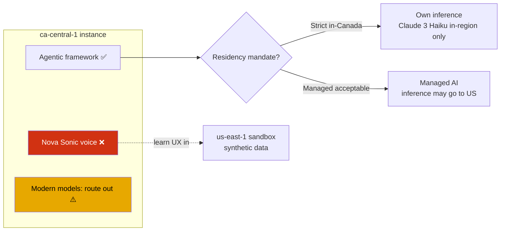

# Running Connect Customer AI Agents in Canada — Region Availability, Data Residency, and the OSFI Reality

> **Research deliverable 3 of 3 — the crux.** A detailed, evidence-led analysis of what a **voice-first Canadian bank** actually gets (and gives up) running Connect Customer AI agents in `ca-central-1` versus `us-east-1`.
> **As of:** 2026-06-09. **Reviewed as:** Connect specialist SA + GenAI specialist SA. Region/feature/model tables below are quoted from AWS docs — primary evidence, not inference.

---

## 1. Executive summary

You can build the full agentic concierge from doc 02 in **`ca-central-1` today** — with two consequential exceptions a Canadian FI must design around:

1. **No expressive voice in Canada.** **Amazon Nova Sonic** speech-to-speech and the **Generative "Set voice" block** are **not available in ca-central-1**. Canadian voice = agentic *logic* on *standard* voice.
2. **Residency is two problems, and both point out of Canada:**
   - **(a) Inference location** — managed-AI cross-region inference for a ca-central-1 instance may process in **US regions**.
   - **(b) Model availability** — ca-central-1 offers a **much smaller model menu**, and the *only* modern model that stays in-region for custom prompts is an older one. Every current-generation model routes out of Canada.

Everything else a bank needs — Cases + AI summaries, full Contact Lens (GenAI summaries/categorization/evaluations), Voice ID, Customer Profiles, native testing & simulation, FIPS endpoints — **is present in ca-central-1.**

## 2. Feature availability — ca-central-1 vs us-east-1

| Capability | us-east-1 | ca-central-1 | Notes |
|---|:---:|:---:|---|
| Connect Customer (core) | ✅ | ✅ | FIPS endpoint both |
| **Connect AI agents** (orchestration, MCP, self-service, assist) | ✅ | ✅ | Agentic framework is in Canada |
| **Nova Sonic agentic voice (S2S)** | ✅ | ❌ | us-east-1/us-west-2 → London → Seoul/Singapore/Frankfurt; **not Canada** |
| **Generative Voice — Set voice block** | ✅ | ❌ | Region list excludes Canada |
| Cases + **AI case summaries** | ✅ | ✅ | |
| Contact Lens (GenAI summaries/categorization/eval, real-time, theme) | ✅ | ✅ | Post-call analytics `Yes*` in Canada (confirm footnote) |
| Voice ID / Customer Profiles | ✅ | ✅ | FIPS endpoints in Canada |
| **Native testing & simulation** | ✅ | ✅ | "all regions where Connect is offered" |
| Agent workspace / Tasks / Data lake / Messaging | ✅ | ✅ | |
| Outbound campaigns | ✅ | ✅ | From Canada you can call **Canadian numbers only** |

The two ❌ rows are the entire story for a **voice** build. This is why doc 02 prototypes in a us-east-1 sandbox (synthetic data) to exercise Nova Sonic, while the production design targets ca-central-1 with standard voice.

## 3. Residency dimension (a) — cross-region inference

Connect Customer's managed AI runs on **Amazon Bedrock** and uses **cross-region inference (CRIS)** to pick an "optimal" Region. The published mapping for a **ca-central-1** instance:

| Instance Region | May run inference in |
|---|---|
| **Canada (Central) `ca-central-1`** | **ca-central-1, us-east-1, us-east-2, us-west-2** |

Compare the Regions that **stay in-geo**: Frankfurt/London → EU only; Sydney → AU only; Tokyo → JP only. **Canada is the outlier** — its pool includes the US.

**Why (SA context):** US instances use **Global CRIS** (route to any commercial Region); EU uses **Geographic CRIS** (stay in EU). Canada is bound to a North-America pool that includes the US. AWS *has* begun shipping **geo-pinned inference** for sovereignty elsewhere — e.g. SageMaker Data Agent added **Japan/Australia** geo-specific inference (Mar 2026) explicitly for regulated FS/healthcare/public sector. **That option does not yet exist for Connect Customer in Canada** per current docs — so it's a roadmap question to push your account team on, not an assumption to design around.

Mitigations that are real but **not sufficient alone** for a hard residency mandate: Bedrock never stores/logs/trains on prompts or responses; all traffic is encrypted on AWS's private network; Connect + Bedrock are in scope for many AWS compliance programs.

## 4. Residency dimension (b) — region-limited models (the sharp finding)

Even *staying* in-region, the **set of usable models depends on the instance Region** — and the model-ID prefix tells you where inference runs:

| Prefix example | Routing |
|---|---|
| `anthropic.claude-3-haiku-20240307-v1:0` (no prefix) | **In-region only** |
| `us.anthropic.claude-…` | US cross-region |
| `eu.` / `jp.` / `au.` / `apac.` | That geography |
| `global.anthropic.claude-…` | **Global CRIS** (any commercial Region) |

### Custom-prompt models: ca-central-1 vs us-east-1 (verified)

| Region | # of custom-prompt models | The models |
|---|:---:|---|
| **us-east-1 / us-west-2** | ~14 | Claude 3.5 Haiku, **Nova Pro/Lite/Micro**, Claude 3.7 Sonnet, Claude 3 Haiku, Claude Sonnet 4, **Claude 4.5 Haiku/Sonnet** (us + global), **GPT-OSS 20b/120b** |
| **ca-central-1** | **4** | `us.anthropic.claude-4-5-sonnet-…` (→US) · `global.anthropic.claude-4-5-haiku-…` (→global) · `global.anthropic.claude-4-5-sonnet-…` (→global) · **`anthropic.claude-3-haiku-20240307-v1:0` (in-region)** |

Read that bottom row carefully. In ca-central-1 there are only **4** custom-prompt models — **no Nova, no GPT-OSS** — and of those four, **exactly one stays in Canada**: `anthropic.claude-3-haiku-20240307` (an older, smaller 2024 model). Every modern model (Claude 4.5 Sonnet/Haiku) carries a `us.` or `global.` prefix and routes out of Canada.

> 🎯 **The decision-grade conclusion:** **strict in-Canada inference effectively pins you to Claude 3 Haiku (2024).** If you want a current-generation model, inference leaves Canada. That is the trade a Canadian bank must make explicitly — capability vs residency — and it's not visible until you read the model table.

### System prompts in ca-central-1 (verified, illustrative rows)
- `SelfServiceOrchestration` (the agentic *brain*): **`global.anthropic.claude-4-5-haiku-20251001-v1:0`** → global CRIS (routes out of Canada).
- `SelfServiceAnswerGeneration`, `SelfServicePreProcessing`, `QueryReformulation`, `IntentLabelingGeneration`: **`anthropic.claude-3-haiku-20240307-v1:0`** → in-region.

> ⚠️ **One inconsistency to confirm with AWS:** the `ai-in-connect` table says ca-central-1 inference is limited to Canada + 3 US Regions, yet the orchestrator's system model carries a **`global.`** prefix (implying any commercial Region). Reconcile these before relying on either — ask which document is authoritative for *your* configuration.

## 5. Compliance levers you DO get natively in Canada

| Requirement | Native control |
|---|---|
| **PII / PCI redaction** (PIPEDA, PCI-DSS) | **AI Guardrails → sensitive-information filters** (block/mask card, SSN, DOB + custom regex, input *and* output) + Contact Lens transcript redaction |
| **Anti-hallucination / accuracy** (OSFI model risk) | **AI Guardrails → contextual grounding checks** |
| **No-investment-advice rule** | **AI Guardrails → denied topic** (see doc 02 §7 — AWS's own example is a "Financial Advice" DENY) |
| **Access governance** (OSFI B-13) | Security profiles bound tool access per AI agent |
| **Auditability** | AI-agent traces (tool invocations, payloads) + CloudTrail + analytics dashboards |
| **Crypto / in-transit** | FIPS endpoints in ca-central-1; encrypted private-network inference |
| **Change risk / pre-prod** | Native testing & simulation (in ca-central-1) + model **version pinning** |

## 6. Decision guidance — three postures

| Path | Residency | AI capability | Voice |
|---|---|---|---|
| **A. Native managed AI in ca-central-1** | ⚠️ inference may go to US; modern models route out | Full agentic logic, Cases/Contact Lens GenAI | ❌ standard voice |
| **B. Strict Canadian residency** | ✅ in-Canada | **Claude 3 Haiku only** for in-region custom prompts; you own inference (custom Bedrock behind MCP); some managed features can't meet the bar | ❌ no Nova Sonic regardless |
| **C. us-east-1 for capability** | ❌ US-resident | Full incl. Nova Sonic + newest models | ✅ Nova Sonic |

For a Canadian bank with real customer data, **Path C is typically off the table for production.** Realistic posture: **A for non-residency-sensitive features + B where residency is mandated**, with a **us-east-1 synthetic-data sandbox** to learn the Nova Sonic voice UX.

## 7. Open questions to close with AWS (before committing)

1. Can **cross-region inference be pinned to `ca-central-1`** (à la the JP/AU geo-specific inference), and for which features?
2. **Nova Sonic ca-central-1 ETA** — quarters or longer? Determines whether to wait for voice parity or design around standard voice now.
3. Reconcile the **`global.` model prefix vs the Canada+US inference table** — which governs my instance?
4. Trajectory of the **ca-central-1 supported-models list** — when do Nova / newer models arrive?
5. Which **compliance attestations** (SOC, PCI, etc.) explicitly cover the Connect Customer AI + Bedrock data path for Canada; OSFI **B-10** third-party-risk artifacts for AWS *and* any third-party MCP servers.
6. The **post-call analytics `Yes*`** caveat for Canada — exact limitation.

## 8. Bottom line

> **The agentic concierge runs in `ca-central-1` today — minus expressive Nova Sonic voice — but a Canadian bank must resolve BOTH residency dimensions before real customer data flows.** The hard truth from the model table: *guaranteed in-Canada inference currently means Claude 3 Haiku (2024); every modern model routes out of Canada.* Native guardrails (PII masking, contextual grounding, investment-advice DENY), FIPS endpoints, security profiles, and in-region testing are genuine compliance levers — the unresolved gap is sovereign *inference*. Prototype voice UX in a us-east-1 synthetic-data sandbox; make the production call **feature-by-feature** using §6's A/B split.

## Sources
- [Availability of Connect Customer features by Region](https://docs.aws.amazon.com/connect/latest/adminguide/regions.html)
- [AI in Connect Customer](https://docs.aws.amazon.com/connect/latest/adminguide/ai-in-connect.html) — Bedrock data handling, **cross-region inference table**
- [Create AI prompts → Supported models for system/custom prompts](https://docs.aws.amazon.com/connect/latest/adminguide/create-ai-prompts.html) — **per-Region model tables** (the §4 evidence)
- [Upgrade models for AI prompts and AI agents](https://docs.aws.amazon.com/connect/latest/adminguide/upgrade-models-ai-prompts-agents.html) — *available models depend on Region*
- [Create AI guardrails](https://docs.aws.amazon.com/connect/latest/adminguide/create-ai-guardrails.html)
- [Connect Decisions: Cross-region processing](https://docs.aws.amazon.com/connect-decisions/latest/adminguide/cross-region-processing.html) — Global vs Geographic CRIS
- What's New: [SageMaker Data Agent geo-specific inference JP/AU (Mar 2026)](https://aws.amazon.com/about-aws/whats-new/2026/03/sage-maker-da-infr-jp-au/) · [Nova Sonic regions](https://aws.amazon.com/about-aws/whats-new/2025/11/amazon-connect-agentic-self-service/)
- [AWS compliance programs / services in scope](https://aws.amazon.com/compliance/services-in-scope/)
